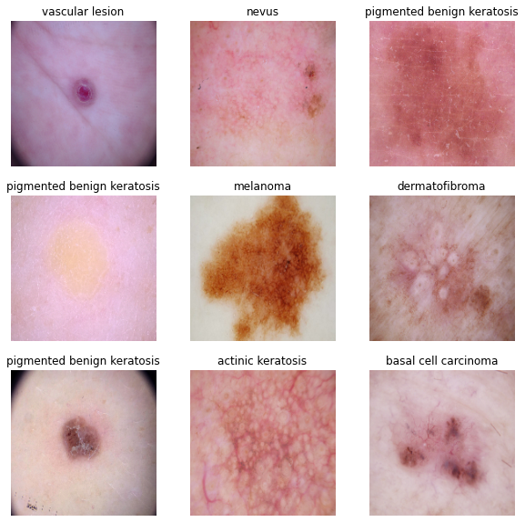
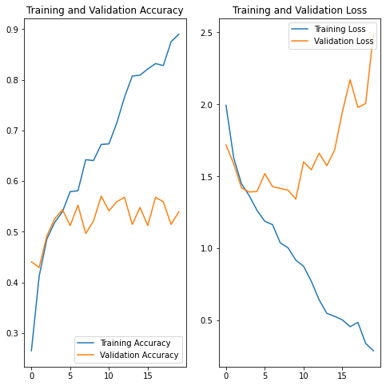
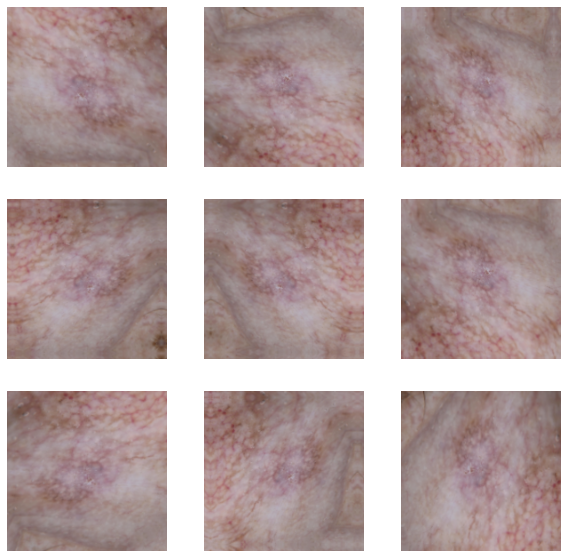
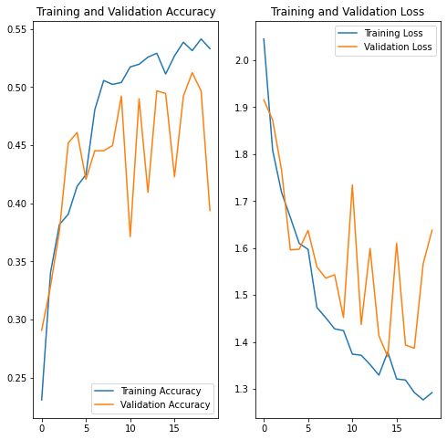
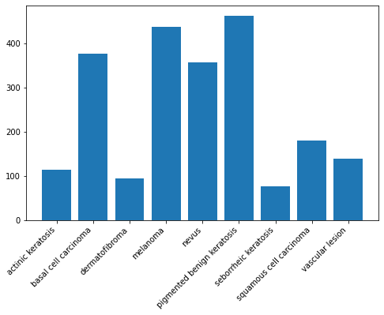
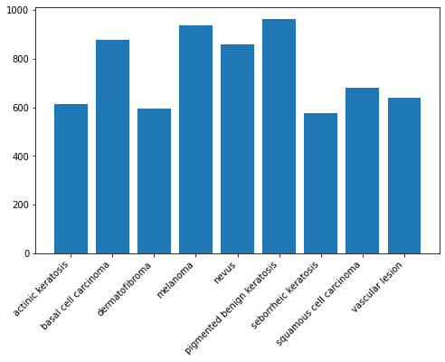
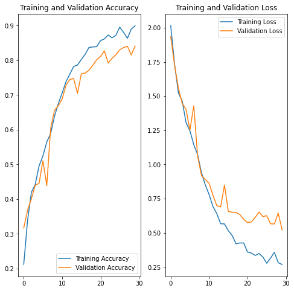

Problem statement: To build a CNN based model which can accurately detect melanoma. Melanoma is a type of cancer that can be deadly if not detected early. It accounts for 75% of skin cancer deaths. A solution which can evaluate images and alert the dermatologists about the presence of melanoma has the potential to reduce a lot of manual effort needed in diagnosis.

### Importing Skin Cancer Data
#### To do: Take necessary actions to read the data

### Importing all the important libraries


```python
import pathlib
import tensorflow as tf
import matplotlib.pyplot as plt
import numpy
import pandas as pd
import os
import PIL
from tensorflow import keras
from tensorflow.keras import layers
from tensorflow.keras.models import Sequential
```


```python
## If you are using the data by mounting the google drive, use the following :
## from google.colab import drive
## drive.mount('/content/gdrive')

##Ref:https://towardsdatascience.com/downloading-datasets-into-google-drive-via-google-colab-bcb1b30b0166
```

This assignment uses a dataset of about 2357 images of skin cancer types. The dataset contains 9 sub-directories in each train and test subdirectories. The 9 sub-directories contains the images of 9 skin cancer types respectively.


```python
# Defining the path for train and test images
## Todo: Update the paths of the train and test dataset
data_dir_train = pathlib.Path(r"Skin cancer ISIC The International Skin Imaging Collaboration\Train")
data_dir_test = pathlib.Path(r"Skin cancer ISIC The International Skin Imaging Collaboration\Test")
```


```python
image_count_train = len(list(data_dir_train.glob('*/*.jpg')))
print(image_count_train)
image_count_test = len(list(data_dir_test.glob('*/*.jpg')))
print(image_count_test)
```

    2239
    118
    

### Load using keras.preprocessing

Let's load these images off disk using the helpful image_dataset_from_directory utility.

### Create a dataset

Defining some parameters for the loader:


```python
batch_size = 32
img_height = 180
img_width = 180
```

Use 80% of the images for training, and 20% for validation.


```python
## Write your train dataset here
## Note use seed=123 while creating your dataset using tf.keras.preprocessing.image_dataset_from_directory
## Note, make sure your resize your images to the size img_height*img_width, while writting the dataset
train_ds = tf.keras.preprocessing.image_dataset_from_directory(
  data_dir_train,
  validation_split=0.2,
  subset="training",
  seed=123,
  image_size=(img_height, img_width),
  batch_size=batch_size)
```

    Found 2239 files belonging to 9 classes.
    Using 1792 files for training.
    


```python
## Write your validation dataset here
## Note use seed=123 while creating your dataset using tf.keras.preprocessing.image_dataset_from_directory
## Note, make sure your resize your images to the size img_height*img_width, while writting the dataset
val_ds = tf.keras.preprocessing.image_dataset_from_directory(
  data_dir_train,
  validation_split=0.2,
  subset="validation",
  seed=123,
  image_size=(img_height, img_width),
  batch_size=batch_size)
```

    Found 2239 files belonging to 9 classes.
    Using 447 files for validation.
    


```python
# List out all the classes of skin cancer and store them in a list. 
# You can find the class names in the class_names attribute on these datasets. 
# These correspond to the directory names in alphabetical order.
class_names = train_ds.class_names
print(class_names)
```

    ['actinic keratosis', 'basal cell carcinoma', 'dermatofibroma', 'melanoma', 'nevus', 'pigmented benign keratosis', 'seborrheic keratosis', 'squamous cell carcinoma', 'vascular lesion']
    

### Visualizing the data


```python
import matplotlib.pyplot as plt

plt.figure(figsize=(10, 10))
for images, labels in train_ds.take(1):
  for i in range(9):
    ax = plt.subplot(3, 3, i + 1)
    plt.imshow(images[i].numpy().astype("uint8"))
    plt.title(class_names[labels[i]])
    plt.axis("off")
```


    

    


The `image_batch` is a tensor of the shape `(32, 180, 180, 3)`. This is a batch of 32 images of shape `180x180x3` (the last dimension refers to color channels RGB). The `label_batch` is a tensor of the shape `(32,)`, these are corresponding labels to the 32 images.

`Dataset.cache()` keeps the images in memory after they're loaded off disk during the first epoch.

`Dataset.prefetch()` overlaps data preprocessing and model execution while training.


```python
AUTOTUNE = tf.data.experimental.AUTOTUNE
train_ds = train_ds.cache().shuffle(1000).prefetch(buffer_size=AUTOTUNE)
val_ds = val_ds.cache().prefetch(buffer_size=AUTOTUNE)
```

### Creating the model
Creating a CNN model, which can accurately detect 9 classes present in the dataset. Using ```layers.experimental.preprocessing.Rescaling``` to normalize pixel values between (0,1). The RGB channel values are in the `[0, 255]` range. This is not ideal for a neural network. Here, it is good to standardize values to be in the `[0, 1]`


```python
num_classes = 9

model = Sequential([
  layers.experimental.preprocessing.Rescaling(1./255, input_shape=(img_height, img_width, 3)),
  layers.Conv2D(16, 3, padding='same', activation='relu'),
  layers.MaxPooling2D(),
  layers.Conv2D(32, 3, padding='same', activation='relu'),
  layers.MaxPooling2D(),
  layers.Conv2D(64, 3, padding='same', activation='relu'),
  layers.MaxPooling2D(),
  layers.Flatten(),
  layers.Dense(128, activation='relu'),
  layers.Dense(num_classes,activation='softmax')
])
```

### Compiling the model
Choose an appropirate optimiser and loss function for model training 


```python
### Todo, choose an appropirate optimiser and loss function
model.compile(optimizer='adam',
              loss=tf.keras.losses.SparseCategoricalCrossentropy(),
              metrics=['accuracy'])
```


```python
# View the summary of all layers
model.summary()
```

    Model: "sequential_22"
    _________________________________________________________________
    Layer (type)                 Output Shape              Param #   
    =================================================================
    rescaling_16 (Rescaling)     (None, 180, 180, 3)       0         
    _________________________________________________________________
    conv2d_60 (Conv2D)           (None, 180, 180, 16)      448       
    _________________________________________________________________
    max_pooling2d_60 (MaxPooling (None, 90, 90, 16)        0         
    _________________________________________________________________
    conv2d_61 (Conv2D)           (None, 90, 90, 32)        4640      
    _________________________________________________________________
    max_pooling2d_61 (MaxPooling (None, 45, 45, 32)        0         
    _________________________________________________________________
    conv2d_62 (Conv2D)           (None, 45, 45, 64)        18496     
    _________________________________________________________________
    max_pooling2d_62 (MaxPooling (None, 22, 22, 64)        0         
    _________________________________________________________________
    flatten_16 (Flatten)         (None, 30976)             0         
    _________________________________________________________________
    dense_32 (Dense)             (None, 128)               3965056   
    _________________________________________________________________
    dense_33 (Dense)             (None, 9)                 1161      
    =================================================================
    Total params: 3,989,801
    Trainable params: 3,989,801
    Non-trainable params: 0
    _________________________________________________________________
    

### Training the model


```python
epochs = 20
history = model.fit(
  train_ds,
  validation_data=val_ds,
  epochs=epochs
)
```

    Epoch 1/20
    56/56 [==============================] - 28s 402ms/step - loss: 1.9937 - accuracy: 0.2651 - val_loss: 1.7181 - val_accuracy: 0.4407
    Epoch 2/20
    56/56 [==============================] - 22s 389ms/step - loss: 1.6267 - accuracy: 0.4124 - val_loss: 1.5865 - val_accuracy: 0.4295
    Epoch 3/20
    56/56 [==============================] - 21s 378ms/step - loss: 1.4485 - accuracy: 0.4860 - val_loss: 1.4204 - val_accuracy: 0.4922
    Epoch 4/20
    56/56 [==============================] - 22s 391ms/step - loss: 1.3651 - accuracy: 0.5184 - val_loss: 1.3913 - val_accuracy: 0.5257
    Epoch 5/20
    56/56 [==============================] - 21s 377ms/step - loss: 1.2641 - accuracy: 0.5396 - val_loss: 1.3957 - val_accuracy: 0.5436
    Epoch 6/20
    56/56 [==============================] - 21s 378ms/step - loss: 1.1883 - accuracy: 0.5792 - val_loss: 1.5191 - val_accuracy: 0.5123
    Epoch 7/20
    56/56 [==============================] - 21s 378ms/step - loss: 1.1650 - accuracy: 0.5809 - val_loss: 1.4289 - val_accuracy: 0.5526
    Epoch 8/20
    56/56 [==============================] - 21s 376ms/step - loss: 1.0380 - accuracy: 0.6423 - val_loss: 1.4168 - val_accuracy: 0.4966
    Epoch 9/20
    56/56 [==============================] - 21s 375ms/step - loss: 1.0041 - accuracy: 0.6406 - val_loss: 1.4042 - val_accuracy: 0.5213
    Epoch 10/20
    56/56 [==============================] - 21s 379ms/step - loss: 0.9185 - accuracy: 0.6724 - val_loss: 1.3424 - val_accuracy: 0.5705
    Epoch 11/20
    56/56 [==============================] - 21s 376ms/step - loss: 0.8762 - accuracy: 0.6735 - val_loss: 1.6004 - val_accuracy: 0.5414
    Epoch 12/20
    56/56 [==============================] - 21s 375ms/step - loss: 0.7715 - accuracy: 0.7148 - val_loss: 1.5463 - val_accuracy: 0.5593
    Epoch 13/20
    56/56 [==============================] - 21s 378ms/step - loss: 0.6433 - accuracy: 0.7656 - val_loss: 1.6616 - val_accuracy: 0.5682
    Epoch 14/20
    56/56 [==============================] - 21s 377ms/step - loss: 0.5490 - accuracy: 0.8075 - val_loss: 1.5744 - val_accuracy: 0.5145
    Epoch 15/20
    56/56 [==============================] - 21s 376ms/step - loss: 0.5284 - accuracy: 0.8092 - val_loss: 1.6828 - val_accuracy: 0.5481
    Epoch 16/20
    56/56 [==============================] - 21s 382ms/step - loss: 0.5035 - accuracy: 0.8214 - val_loss: 1.9489 - val_accuracy: 0.5123
    Epoch 17/20
    56/56 [==============================] - 21s 380ms/step - loss: 0.4565 - accuracy: 0.8320 - val_loss: 2.1713 - val_accuracy: 0.5682
    Epoch 18/20
    56/56 [==============================] - 21s 376ms/step - loss: 0.4863 - accuracy: 0.8281 - val_loss: 1.9792 - val_accuracy: 0.5593
    Epoch 19/20
    56/56 [==============================] - 21s 382ms/step - loss: 0.3406 - accuracy: 0.8750 - val_loss: 2.0060 - val_accuracy: 0.5145
    Epoch 20/20
    56/56 [==============================] - 21s 378ms/step - loss: 0.2891 - accuracy: 0.8901 - val_loss: 2.4874 - val_accuracy: 0.5391
    

### Visualizing training results


```python
acc = history.history['accuracy']
val_acc = history.history['val_accuracy']

loss = history.history['loss']
val_loss = history.history['val_loss']

epochs_range = range(epochs)

plt.figure(figsize=(8, 8))
plt.subplot(1, 2, 1)
plt.plot(epochs_range, acc, label='Training Accuracy')
plt.plot(epochs_range, val_acc, label='Validation Accuracy')
plt.legend(loc='lower right')
plt.title('Training and Validation Accuracy')

plt.subplot(1, 2, 2)
plt.plot(epochs_range, loss, label='Training Loss')
plt.plot(epochs_range, val_loss, label='Validation Loss')
plt.legend(loc='upper right')
plt.title('Training and Validation Loss')
plt.show()
```


    

    


### The model is clearly OVERFITING

- #### Training Accuracy ~ 89%
- #### Validation Accuracy ~ 53%

As we can see that the training accuracy is increasing after every epoch and goes up to 91% but the validation accuracy gets stuck arround 53% after a few epoch. To deal with this problem we will. 

- #### Introduce a new augumentation layer which will do following
    - Random Rotation
    - Random Flipping
    - Random Zooming
- #### Use dropouts 


```python
# Todo, after you have analysed the model fit history for presence of underfit or overfit, choose an appropriate data augumentation strategy. 
data_augmentation = keras.Sequential(
  [
    layers.experimental.preprocessing.RandomRotation(1),
    layers.experimental.preprocessing.RandomZoom(0.1),
    layers.experimental.preprocessing.RandomFlip("horizontal",input_shape=(img_height, img_width,3))
  ]
)
```


```python
# Todo, visualize how your augmentation strategy works for one instance of training image.
plt.figure(figsize=(10, 10))
for images, _ in train_ds.take(1):
  for i in range(9):
    augmented_images = data_augmentation(images)
    ax = plt.subplot(3, 3, i + 1)
    plt.imshow(augmented_images[0].numpy().astype("uint8"))
    plt.axis("off")
```


    

    


### Todo:
### Create the model, compile and train the model


```python
## You can use Dropout layer if there is an evidence of overfitting in your findings

model = Sequential([
  data_augmentation,
  layers.experimental.preprocessing.Rescaling(1./255),
  layers.Conv2D(16, 3, padding='same', activation='relu'),
  layers.MaxPooling2D(),
  layers.Dropout(0.2),
  layers.Conv2D(32, 3, padding='same', activation='relu'),
  layers.MaxPooling2D(),
  layers.Dropout(0.2),
  layers.Conv2D(64, 3, padding='same', activation='relu'),
  layers.MaxPooling2D(),
  layers.Dropout(0.2),
  layers.Conv2D(128, 3, padding='same', activation='relu'),
  layers.MaxPooling2D(),
  layers.Dropout(0.2),
  layers.Flatten(),
  layers.Dense(256, activation='relu'),
  layers.Dropout(0.3),
  layers.Dense(num_classes, activation='softmax')
])
```

### Compiling the model


```python
model.compile(optimizer='adam',
              loss=tf.keras.losses.SparseCategoricalCrossentropy(),
              metrics=['accuracy'])
```

### Training the model


```python
## Your code goes here, note: train your model for 20 epochs
epochs = 20
history = model.fit(
  train_ds,
  validation_data=val_ds,
  epochs=epochs
)
```

    Epoch 1/20
    56/56 [==============================] - 34s 573ms/step - loss: 2.0455 - accuracy: 0.2310 - val_loss: 1.9159 - val_accuracy: 0.2908
    Epoch 2/20
    56/56 [==============================] - 32s 571ms/step - loss: 1.8082 - accuracy: 0.3404 - val_loss: 1.8727 - val_accuracy: 0.3289
    Epoch 3/20
    56/56 [==============================] - 34s 600ms/step - loss: 1.7190 - accuracy: 0.3817 - val_loss: 1.7670 - val_accuracy: 0.3758
    Epoch 4/20
    56/56 [==============================] - 34s 614ms/step - loss: 1.6651 - accuracy: 0.3906 - val_loss: 1.5959 - val_accuracy: 0.4519
    Epoch 5/20
    56/56 [==============================] - 33s 598ms/step - loss: 1.6098 - accuracy: 0.4146 - val_loss: 1.5974 - val_accuracy: 0.4609
    Epoch 6/20
    56/56 [==============================] - 32s 571ms/step - loss: 1.5971 - accuracy: 0.4247 - val_loss: 1.6374 - val_accuracy: 0.4206
    Epoch 7/20
    56/56 [==============================] - 32s 564ms/step - loss: 1.4732 - accuracy: 0.4805 - val_loss: 1.5597 - val_accuracy: 0.4452
    Epoch 8/20
    56/56 [==============================] - 32s 574ms/step - loss: 1.4514 - accuracy: 0.5056 - val_loss: 1.5357 - val_accuracy: 0.4452
    Epoch 9/20
    56/56 [==============================] - 34s 612ms/step - loss: 1.4277 - accuracy: 0.5022 - val_loss: 1.5431 - val_accuracy: 0.4497
    Epoch 10/20
    56/56 [==============================] - 34s 610ms/step - loss: 1.4240 - accuracy: 0.5039 - val_loss: 1.4518 - val_accuracy: 0.4922
    Epoch 11/20
    56/56 [==============================] - 32s 571ms/step - loss: 1.3738 - accuracy: 0.5173 - val_loss: 1.7345 - val_accuracy: 0.3714
    Epoch 12/20
    56/56 [==============================] - 32s 566ms/step - loss: 1.3715 - accuracy: 0.5195 - val_loss: 1.4371 - val_accuracy: 0.4899
    Epoch 13/20
    56/56 [==============================] - 32s 564ms/step - loss: 1.3516 - accuracy: 0.5257 - val_loss: 1.5993 - val_accuracy: 0.4094
    Epoch 14/20
    56/56 [==============================] - 33s 598ms/step - loss: 1.3291 - accuracy: 0.5290 - val_loss: 1.4127 - val_accuracy: 0.4966
    Epoch 15/20
    56/56 [==============================] - 34s 612ms/step - loss: 1.3785 - accuracy: 0.5112 - val_loss: 1.3684 - val_accuracy: 0.4944
    Epoch 16/20
    56/56 [==============================] - 33s 593ms/step - loss: 1.3209 - accuracy: 0.5268 - val_loss: 1.6102 - val_accuracy: 0.4228
    Epoch 17/20
    56/56 [==============================] - 32s 570ms/step - loss: 1.3187 - accuracy: 0.5385 - val_loss: 1.3932 - val_accuracy: 0.4922
    Epoch 18/20
    56/56 [==============================] - 32s 564ms/step - loss: 1.2920 - accuracy: 0.5312 - val_loss: 1.3865 - val_accuracy: 0.5123
    Epoch 19/20
    56/56 [==============================] - 32s 572ms/step - loss: 1.2764 - accuracy: 0.5413 - val_loss: 1.5668 - val_accuracy: 0.4966
    Epoch 20/20
    56/56 [==============================] - 34s 615ms/step - loss: 1.2920 - accuracy: 0.5329 - val_loss: 1.6381 - val_accuracy: 0.3937
    

### Visualizing the results


```python
acc = history.history['accuracy']
val_acc = history.history['val_accuracy']

loss = history.history['loss']
val_loss = history.history['val_loss']

epochs_range = range(epochs)

plt.figure(figsize=(8, 8))
plt.subplot(1, 2, 1)
plt.plot(epochs_range, acc, label='Training Accuracy')
plt.plot(epochs_range, val_acc, label='Validation Accuracy')
plt.legend(loc='lower right')
plt.title('Training and Validation Accuracy')

plt.subplot(1, 2, 2)
plt.plot(epochs_range, loss, label='Training Loss')
plt.plot(epochs_range, val_loss, label='Validation Loss')
plt.legend(loc='upper right')
plt.title('Training and Validation Loss')
plt.show()
```


    

    


### The model is UNDERFITING

- #### Training Accuracy ~ 52%
- #### Validation Accuracy ~ 46%

The gap between training and testing accuracy has decreased but the overall accuracy of the model did not improve. We will check for class imballance in the dataset.  

#### **Todo:** Find the distribution of classes in the training dataset.
#### **Context:** Many times real life datasets can have class imbalance, one class can have proportionately higher number of samples compared to the others. Class imbalance can have a detrimental effect on the final model quality. Hence as a sanity check it becomes important to check what is the distribution of classes in the data.


```python
plt.figure(figsize=(8, 5))
plt.xticks(rotation=45, ha="right")
plt.bar(x=class_names,height=[len(list(data_dir_train.glob(c+'/*.jpg'))) for c in class_names])
```


    <BarContainer object of 9 artists>


    

    


#### We can see that the dataset is highly imballanced.
#### - Class "Pigmented Benign Keratosis" has the highest number of sample images
#### - Class "Seborrheic Keratosis" has the lowest number of sample images


#### **Todo:** Rectify the class imbalance
#### **Context:** You can use a python package known as `Augmentor` (https://augmentor.readthedocs.io/en/master/) to add more samples across all classes so that none of the classes have very few samples.


```python
!pip install Augmentor
```

    Requirement already satisfied: Augmentor in c:\users\prakhar\anaconda3\lib\site-packages (0.2.8)
    Requirement already satisfied: Pillow>=5.2.0 in c:\users\prakhar\anaconda3\lib\site-packages (from Augmentor) (8.0.1)
    Requirement already satisfied: numpy>=1.11.0 in c:\users\prakhar\anaconda3\lib\site-packages (from Augmentor) (1.20.3)
    Requirement already satisfied: future>=0.16.0 in c:\users\prakhar\anaconda3\lib\site-packages (from Augmentor) (0.18.2)
    Requirement already satisfied: tqdm>=4.9.0 in c:\users\prakhar\anaconda3\lib\site-packages (from Augmentor) (4.50.2)
    

To use `Augmentor`, the following general procedure is followed:

1. Instantiate a `Pipeline` object pointing to a directory containing your initial image data set.<br>
2. Define a number of operations to perform on this data set using your `Pipeline` object.<br>
3. Execute these operations by calling the `Pipeline’s` `sample()` method.


```python
path_to_training_dataset= r"Skin cancer ISIC The International Skin Imaging Collaboration\Train\\"
import Augmentor
for i in class_names:
    p = Augmentor.Pipeline(path_to_training_dataset + i)
    p.rotate(probability=0.7, max_left_rotation=10, max_right_rotation=10)
    p.sample(500) ## We are adding 500 samples per class to make sure that none of the classes are sparse.
```

    Executing Pipeline:   0%|                                                                | 0/500 [00:00<?, ? Samples/s]

    Initialised with 114 image(s) found.
    Output directory set to Skin cancer ISIC The International Skin Imaging Collaboration\Train\\actinic keratosis\output.

    Processing <PIL.Image.Image image mode=RGB size=600x450 at 0x20FDA7F7D30>: 100%|█| 500/500 [00:04<00:00, 103.92 Samples
    Executing Pipeline:   0%|                                                                | 0/500 [00:00<?, ? Samples/s]

    Initialised with 376 image(s) found.
    Output directory set to Skin cancer ISIC The International Skin Imaging Collaboration\Train\\basal cell carcinoma\output.

    Processing <PIL.Image.Image image mode=RGB size=600x450 at 0x20FDA906940>: 100%|█| 500/500 [00:05<00:00, 99.86 Samples/
    Processing <PIL.Image.Image image mode=RGB size=600x450 at 0x20FDA9AE4C0>:   0%|         | 0/500 [00:00<?, ? Samples/s]

    Initialised with 95 image(s) found.
    Output directory set to Skin cancer ISIC The International Skin Imaging Collaboration\Train\\dermatofibroma\output.

    Processing <PIL.JpegImagePlugin.JpegImageFile image mode=RGB size=600x450 at 0x20FA2297FD0>: 100%|█| 500/500 [00:05<00:
    Executing Pipeline:   0%|                                                                | 0/500 [00:00<?, ? Samples/s]

    Initialised with 438 image(s) found.
    Output directory set to Skin cancer ISIC The International Skin Imaging Collaboration\Train\\melanoma\output.

    Processing <PIL.JpegImagePlugin.JpegImageFile image mode=RGB size=3072x2304 at 0x20F8958E520>: 100%|█| 500/500 [00:25<0
    Executing Pipeline:   0%|                                                                | 0/500 [00:00<?, ? Samples/s]

    Initialised with 357 image(s) found.
    Output directory set to Skin cancer ISIC The International Skin Imaging Collaboration\Train\\nevus\output.

    Processing <PIL.Image.Image image mode=RGB size=3072x2304 at 0x20F9C174AC0>: 100%|█| 500/500 [00:21<00:00, 22.80 Sample
    Processing <PIL.Image.Image image mode=RGB size=600x450 at 0x20F86E5CD90>:   3%| | 16/500 [00:00<00:26, 18.05 Samples/s

    Initialised with 462 image(s) found.
    Output directory set to Skin cancer ISIC The International Skin Imaging Collaboration\Train\\pigmented benign keratosis\output.

    Processing <PIL.Image.Image image mode=RGB size=600x450 at 0x20FA3EC0310>: 100%|█| 500/500 [00:04<00:00, 110.59 Samples
    Executing Pipeline:   0%|                                                                | 0/500 [00:00<?, ? Samples/s]

    Initialised with 77 image(s) found.
    Output directory set to Skin cancer ISIC The International Skin Imaging Collaboration\Train\\seborrheic keratosis\output.

    Processing <PIL.Image.Image image mode=RGB size=1024x768 at 0x20FD926C430>: 100%|█| 500/500 [00:10<00:00, 48.41 Samples
    Processing <PIL.JpegImagePlugin.JpegImageFile image mode=RGB size=600x450 at 0x20F9F556490>:   2%| | 8/500 [00:00<00:26

    Initialised with 181 image(s) found.
    Output directory set to Skin cancer ISIC The International Skin Imaging Collaboration\Train\\squamous cell carcinoma\output.

    Processing <PIL.Image.Image image mode=RGB size=600x450 at 0x20F9862EDC0>: 100%|█| 500/500 [00:04<00:00, 114.77 Samples
    Processing <PIL.Image.Image image mode=RGB size=600x450 at 0x20F9F25B880>:   0%| | 1/500 [00:00<01:25,  5.83 Samples/s]

    Initialised with 139 image(s) found.
    Output directory set to Skin cancer ISIC The International Skin Imaging Collaboration\Train\\vascular lesion\output.

    Processing <PIL.Image.Image image mode=RGB size=600x450 at 0x20FA0E09B80>: 100%|█| 500/500 [00:04<00:00, 109.22 Samples
    

Augmentor has stored the augmented images in the output sub-directory of each of the sub-directories of skin cancer types.. Lets take a look at total count of augmented images.


```python
image_count_train = len(list(data_dir_train.glob('*/output/*.jpg')))
print(image_count_train)
```

    4500
    

### Lets see the distribution of augmented data after adding new images to the original training data.


```python
# path_list = [x for x in data_dir_train.glob(os.path.join('*','output', '*.jpg'))]
# path_list_new = path_list
```


```python
# lesion_list_new = [os.path.basename(os.path.dirname(os.path.dirname(y))) for y in data_dir_train.glob(os.path.join('*','output', '*.jpg'))]
# lesion_list_new
```


```python
# dataframe_dict_new = dict(zip(path_list_new, lesion_list_new))
```


```python
# df2 = pd.DataFrame(list(dataframe_dict_new.items()),columns = ['Path','Label'])
# new_df = original_df.append(df2)
```


```python
# new_df['Label'].value_counts()
```


```python
plt.figure(figsize=(8, 5))
plt.xticks(rotation=45, ha="right")
plt.bar(x=class_names,height=[len(list(data_dir_train.glob(c+'/*.jpg'))) + len(list(data_dir_train.glob(c+'/output/*.jpg'))) for c in class_names])
```


    <BarContainer object of 9 artists>


    

    


So, now we have added 500 images to all the classes to maintain some class balance. We can add more images as we want to improve training process.

#### **Todo**: Train the model on the data created using Augmentor


```python
batch_size = 32
img_height = 180
img_width = 180
```

#### **Todo:** Create a training dataset


```python
# data_dir_train="path to directory with training data + data created using augmentor"
train_ds = tf.keras.preprocessing.image_dataset_from_directory(
  data_dir_train,
  seed=123,
  validation_split = 0.2,
  subset = "training",
  image_size=(img_height, img_width),
  batch_size=batch_size)
```

    Found 6739 files belonging to 9 classes.
    Using 5392 files for training.
    

#### **Todo:** Create a validation dataset


```python
val_ds = tf.keras.preprocessing.image_dataset_from_directory(
  data_dir_train,
  seed=123,
  validation_split = 0.2,
  subset = 'validation',
  image_size=(img_height, img_width),
  batch_size=batch_size)
```

    Found 6739 files belonging to 9 classes.
    Using 1347 files for validation.
    

#### **Todo:** Create your model (make sure to include normalization)


```python
model = Sequential([
  layers.experimental.preprocessing.Rescaling(1./255),
  layers.Conv2D(16, 3, padding='same', activation='relu'),
  layers.MaxPooling2D(),
  layers.Dropout(0.2),
  layers.Conv2D(32, 3, padding='same', activation='relu'),
  layers.MaxPooling2D(),
  layers.Dropout(0.2),
  layers.Conv2D(64, 3, padding='same', activation='relu'),
  layers.MaxPooling2D(),
  layers.Dropout(0.2),
  layers.Conv2D(128, 3, padding='same', activation='relu'),
  layers.MaxPooling2D(),
  layers.Dropout(0.2),
  layers.Flatten(),
  layers.Dense(256, activation='relu'),
  layers.Dropout(0.3),
  layers.Dense(num_classes, activation='softmax')
])
```

#### **Todo:** Compile your model (Choose optimizer and loss function appropriately)


```python
model.compile(optimizer='adam',
              loss=tf.keras.losses.SparseCategoricalCrossentropy(),
              metrics=['accuracy'])
```

#### **Todo:**  Train your model


```python
epochs = 30
history = model.fit(
  train_ds,
  validation_data=val_ds,
  epochs=epochs
)
```

    Epoch 1/30
    169/169 [==============================] - 106s 617ms/step - loss: 2.0144 - accuracy: 0.2120 - val_loss: 1.9336 - val_accuracy: 0.3170
    Epoch 2/30
    169/169 [==============================] - 98s 575ms/step - loss: 1.7341 - accuracy: 0.3388 - val_loss: 1.7268 - val_accuracy: 0.3682
    Epoch 3/30
    169/169 [==============================] - 99s 585ms/step - loss: 1.5227 - accuracy: 0.4201 - val_loss: 1.5581 - val_accuracy: 0.4016
    Epoch 4/30
    169/169 [==============================] - 97s 571ms/step - loss: 1.4630 - accuracy: 0.4425 - val_loss: 1.4459 - val_accuracy: 0.4402
    Epoch 5/30
    169/169 [==============================] - 100s 591ms/step - loss: 1.3049 - accuracy: 0.4959 - val_loss: 1.4026 - val_accuracy: 0.4454
    Epoch 6/30
    169/169 [==============================] - 96s 565ms/step - loss: 1.2468 - accuracy: 0.5245 - val_loss: 1.2513 - val_accuracy: 0.5108
    Epoch 7/30
    169/169 [==============================] - 100s 587ms/step - loss: 1.1454 - accuracy: 0.5645 - val_loss: 1.4298 - val_accuracy: 0.4388
    Epoch 8/30
    169/169 [==============================] - 97s 571ms/step - loss: 1.0739 - accuracy: 0.5886 - val_loss: 1.0624 - val_accuracy: 0.6028
    Epoch 9/30
    169/169 [==============================] - 99s 584ms/step - loss: 0.9409 - accuracy: 0.6384 - val_loss: 0.9205 - val_accuracy: 0.6555
    Epoch 10/30
    169/169 [==============================] - 98s 577ms/step - loss: 0.8511 - accuracy: 0.6749 - val_loss: 0.8903 - val_accuracy: 0.6689
    Epoch 11/30
    169/169 [==============================] - 98s 580ms/step - loss: 0.7801 - accuracy: 0.7055 - val_loss: 0.8626 - val_accuracy: 0.6882
    Epoch 12/30
    169/169 [==============================] - 99s 581ms/step - loss: 0.6924 - accuracy: 0.7381 - val_loss: 0.7751 - val_accuracy: 0.7275
    Epoch 13/30
    169/169 [==============================] - 98s 575ms/step - loss: 0.6406 - accuracy: 0.7596 - val_loss: 0.6992 - val_accuracy: 0.7446
    Epoch 14/30
    169/169 [==============================] - 100s 589ms/step - loss: 0.5667 - accuracy: 0.7821 - val_loss: 0.6897 - val_accuracy: 0.7476
    Epoch 15/30
    169/169 [==============================] - 97s 571ms/step - loss: 0.5657 - accuracy: 0.7862 - val_loss: 0.8502 - val_accuracy: 0.7045
    Epoch 16/30
    169/169 [==============================] - 100s 592ms/step - loss: 0.5159 - accuracy: 0.8025 - val_loss: 0.6574 - val_accuracy: 0.7610
    Epoch 17/30
    169/169 [==============================] - 97s 569ms/step - loss: 0.4809 - accuracy: 0.8171 - val_loss: 0.6509 - val_accuracy: 0.7632
    Epoch 18/30
    169/169 [==============================] - 100s 589ms/step - loss: 0.4202 - accuracy: 0.8370 - val_loss: 0.6502 - val_accuracy: 0.7713
    Epoch 19/30
    169/169 [==============================] - 97s 574ms/step - loss: 0.4262 - accuracy: 0.8383 - val_loss: 0.6341 - val_accuracy: 0.7854
    Epoch 20/30
    169/169 [==============================] - 99s 584ms/step - loss: 0.4262 - accuracy: 0.8390 - val_loss: 0.5984 - val_accuracy: 0.8018
    Epoch 21/30
    169/169 [==============================] - 99s 585ms/step - loss: 0.3598 - accuracy: 0.8566 - val_loss: 0.5747 - val_accuracy: 0.8107
    Epoch 22/30
    169/169 [==============================] - 98s 578ms/step - loss: 0.3526 - accuracy: 0.8615 - val_loss: 0.5802 - val_accuracy: 0.8270
    Epoch 23/30
    169/169 [==============================] - 99s 582ms/step - loss: 0.3349 - accuracy: 0.8728 - val_loss: 0.6128 - val_accuracy: 0.7921
    Epoch 24/30
    169/169 [==============================] - 97s 572ms/step - loss: 0.3490 - accuracy: 0.8646 - val_loss: 0.6528 - val_accuracy: 0.8055
    Epoch 25/30
    169/169 [==============================] - 99s 586ms/step - loss: 0.3237 - accuracy: 0.8717 - val_loss: 0.6191 - val_accuracy: 0.8159
    Epoch 26/30
    169/169 [==============================] - 96s 567ms/step - loss: 0.2778 - accuracy: 0.8956 - val_loss: 0.6256 - val_accuracy: 0.8300
    Epoch 27/30
    169/169 [==============================] - 100s 592ms/step - loss: 0.3155 - accuracy: 0.8802 - val_loss: 0.5663 - val_accuracy: 0.8367
    Epoch 28/30
    169/169 [==============================] - 97s 569ms/step - loss: 0.3578 - accuracy: 0.8633 - val_loss: 0.5655 - val_accuracy: 0.8404
    Epoch 29/30
    169/169 [==============================] - 99s 586ms/step - loss: 0.2816 - accuracy: 0.8895 - val_loss: 0.6446 - val_accuracy: 0.8151
    Epoch 30/30
    169/169 [==============================] - 97s 573ms/step - loss: 0.2691 - accuracy: 0.8993 - val_loss: 0.5226 - val_accuracy: 0.8411
    

#### **Todo:**  Visualize the model results


```python
acc = history.history['accuracy']
val_acc = history.history['val_accuracy']

loss = history.history['loss']
val_loss = history.history['val_loss']

epochs_range = range(epochs)

plt.figure(figsize=(8, 8))
plt.subplot(1, 2, 1)
plt.plot(epochs_range, acc, label='Training Accuracy')
plt.plot(epochs_range, val_acc, label='Validation Accuracy')
plt.legend(loc='lower right')
plt.title('Training and Validation Accuracy')

plt.subplot(1, 2, 2)
plt.plot(epochs_range, loss, label='Training Loss')
plt.plot(epochs_range, val_loss, label='Validation Loss')
plt.legend(loc='upper right')
plt.title('Training and Validation Loss')
plt.show()
```


    

    


#### **Todo:**  Analyze your results here. Did you get rid of underfitting/overfitting? Did class rebalance help?


### This looks like a GOODFIT

- #### Training Accuracy ~ 87%
- #### Validation Accuracy ~ 85%

After performing augumentation, both training as well as the validation accuracies improved significantly. and we have a model with decent accuracy.
